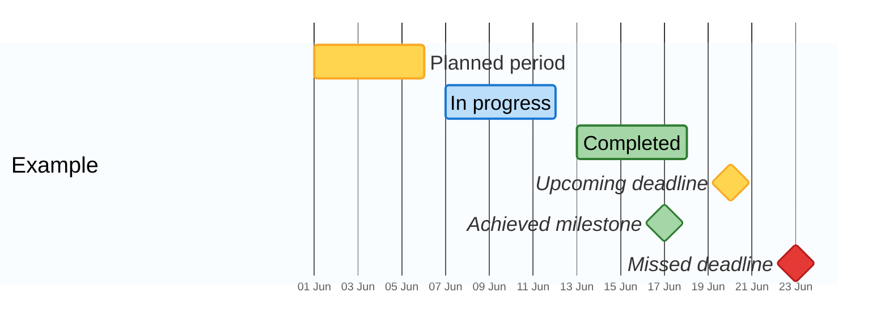

# lorite-mermaid-gantt — gantt colour convention

The single source of truth for how lorite gantt charts look. Put the canonical `init` block on every
gantt; then **the task's tag chooses its colour and meaning** — no per-task styling needed. The block
also widens rows and enlarges the font (good for slides).

## Canonical init block

Tune `gantt.leftPadding` for long task labels, and `barHeight` / `fontSize` / `sectionFontSize` for
the surface (bigger for slides, smaller for dense notes). Use `todayMarker on` to show "now".

## Period bars (rectangles)

| Tag | Colour | Meaning |
|---|---|---|
| _(no tag)_ | 🟡 amber | planned / upcoming |
| `:active` | 🔵 blue | in progress |
| `:done` | 🟢 green | completed |
| `:crit` | 🔴 red | missed / overdue |

## Milestones (diamonds, italic label — same fill rules)

| Tag | Colour | Meaning |
|---|---|---|
| `:milestone` | 🟡 amber | upcoming deadline |
| `:milestone, active` | 🔵 blue | happening today |
| `:milestone, done` | 🟢 green | achieved |
| `:milestone, crit` | 🔴 red | missed |

## `crit` on `:active` / `:done` (special case)

`crit` combined with `active`/`done` does **not** repaint the fill — it keeps the fill and only turns
the **border** red (`critBorderColor`):

| Tag | Fill | Border | Reads as |
|---|---|---|---|
| `:active, crit` | blue | red | in progress, but at-risk |
| `:done, crit` | green | red | completed, but was critical |

## Gotchas

- Untagged period tasks are **valid** — they are the amber "planned" state; don't force a tag on them.
- A gantt that renders **blank** is a Mermaid parse error — `slidev build` does **not** catch it and
  it's only visible once rendered. Compare against the block above, and **ask the user to confirm the
  render** rather than exporting + reading a PDF yourself (token-expensive; see
  `lorite-slidev-meeting-deck` §5).
